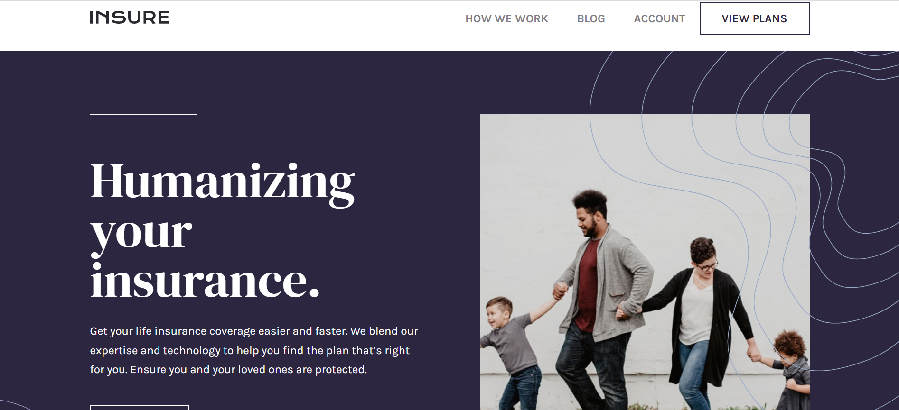

# Insure Landing Page 

This is a solution to the [Insure Landing Page challenge on Frontend Mentor](https://www.frontendmentor.io/challenges/insure-landing-page-uTU68JV8). Frontend Mentor Challenges help you improve your coding skills by building realistic projects.

## Table of Contents

- [Overview](#overview)
  - [The Challenge](#the-challenge)
  - [Screenshot](#screenshot)
  - [Links](#links)
- [My process](#my-process)
  - [Built with](#built-with)
  - [Code Snippet](#code-snippet)
- [Author](#author)

## Overview

### The Challenge

- View the optimal layout for the site depending on their device's screen size
- See hover states for all interactive elements on the page

### Screenshot



### Links

- [Live Site URL]()
- [Solution URL](https://github.com/aniru-dh21/Insure-Landing-Page)

## My Process

### Built With

- Semantic HTML5 markup
- CSS custom properties
- Flexbox
- Mobile-First Workflow

### Code Snippet

```js
imgBtn.addEventListener("click", function(){
    var menuMobile = document.getElementById("menu-mobile-items");

    if(menuMobile.style.display === "none") {
        menuMobile.style.display = "block";
        imgBtn.src = './images/icon-close.svg';
    } else {
        menuMobile.style.display = "none";
        imgBtn.src = './images/icon-hamburger.svg';
    }
})
```
